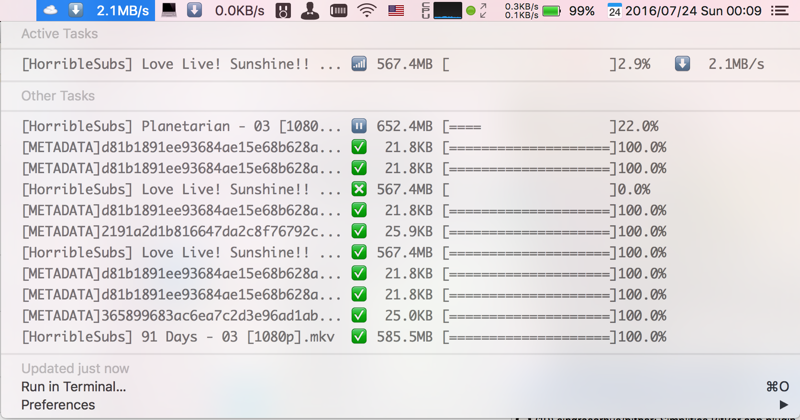

#BitBar Plugins
A repo of [BitBar](https://github.com/matryer/bitbar) plugins

## Aria2
Show [aria2](https://github.com/aria2/aria2) tasks in menu bar.



### Usage
```bash
git clone https://github.com/15cm/bitbar-plugin.git
cd bitbar-plugins
npm install
```

Modify aria2/aria2.js with your config:

- Node.js executable path (Written with some ES6 features. Test with v6.3.1)
- aria2 config

Then rename aria2/aria2.js to aria2/aria2.3s.js (Set refresh time as you like),
and make a symbol link of it to your BitBar plugin folder.
